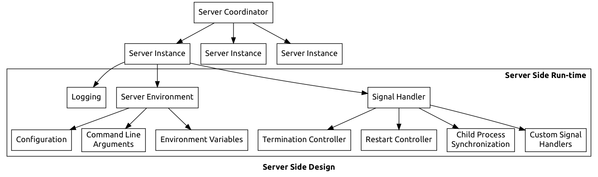

# ServerSide

[![Platform][platform-badge]][platform-url]
[![License][mit-badge]][mit-url]

A swift implementation for a server application. 

Server Side is a small project which aim is to create all boiler plate code for
a unix server, integrating:

- startup systems, like System V or upstart;
- configuration files in several formats like INI, Yaml, XML, etc;
- system logging with Syslog
- signal handling
- IPC
- child process control and spawning
- process priority control
- etc

Server software is basic a repetition of those features. So, Server Side is
intended to create the full run-time so you have to worry about writing what
matters: your business code.

## Zewo

Server Side is designed to interoperate with Zewo server software. In fact,
Server Side is a complementation of Zewo, adding a lot of boiler plate in order
to make your life easier.

## ServerSide Design

## License

This software is distributed under [MIT License][mit-url].

[platform-badge]: https://img.shields.io/badge/Platform-Mac%20%26%20Linux-lightgray.svg?style=flat
[platform-url]: https://swift.org
[mit-badge]: https://img.shields.io/badge/License-MIT-blue.svg?style=flat
[mit-url]: https://tldrlegal.com/license/mit-license
